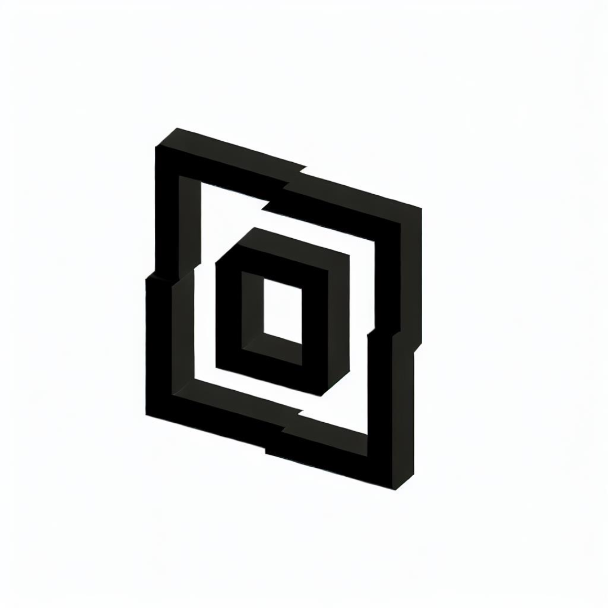
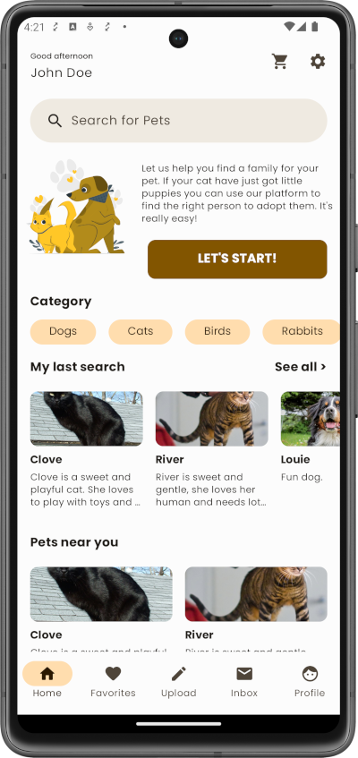

<!--
  Title: Multiplatform Kickstarter Template
  Description: The first Open Source Template with all boilerplate code needed to quickly create Kotlin Multiplatform Applications.
  Author: Multiplatform Kickstarter
  -->

❗ **IMPORTANT** ❗ This is only a **PREVIEW**. This template is still under development. It's possible it has bugs and some things could not work properly. 

* <i>The Multiplatform Kickstarter Basic Template</i> *

The first Open Source Template with all boilerplate code needed to quickly create Kotlin Multiplatform Applications.

  

<b><a href="#features">Features</a></b>
|
<b><a href="#download">Download</a></b>
|
<b><a href="#usage">Usage</a></b>
|
<b><a href="#advanced-template">Advanced Template</a></b>
|
<b><a href="#who-made-this">Who Made This</a></b>
|
<b><a href="#contribute">Contribute</a></b>
|
<b><a href="#bugs-and-feedback">Bugs and Feedback</a></b>
|
<b><a href="#socila-media">Social Media</a></b>
|
<b><a href="#license">License</a></b>

 

### Features

Multiplatform Kickstarter is an opinionated template based in Kotlin Multiplatform (KMP) and Compose Multiplatform. While most templates only solves the basic functionality, we are aiming to solve most of the common problems when creating applications from initial status to production. 

Comes with this stack built-in:

- **Shared UI and Logic for all platforms**
- **Kotlin** 1.9.10
- **Compose Multiplatform** 1.5.10-rc02
- **Kotlin Coroutines**
- **Kotlin Serialization**
- **Kotlin Datetime**
- **Voyager** for Navigation and View Models
- **Koin** as Dependency Injection
- **Detekt** for static code analysis
- **Ktlint** linter
- **Ktor** for Client
- **Multiplatform-settings** for storage
- **Kamel** for Images
- **Kermit** for logging
- **Version Catalogs**
- **Ktor for Server** (PostgresSQL+Tomcat)
- **Swagger Codegen** for **OpenAPI**

#### Components and Screens

* Login/Sign Up
* Basic listing
* Basic insertion form
* Basic Detail
* Basic Debug Mode
* Basic Profile
* Basic CI
* Basic Composable Components
* Dark mode ready
* Navigation
* Accessibility (and color accessible themes)
* Tracking system
* Internationalization (FIGS)
   

### Download

Click to "Use This Template" button to create a new repository using this template.

### Usage

Go to the [Documentation page](https://docs.multiplatformkickstarter.com) for all the information.

PRO Template
-----------------

Do you need more? The Basic template is a good start but the **Pro template** have all you need to create professional apps without a hassle.
It includes more features, screens and components. Like:

- OnBoarding Carousel
- Advanced CI (deployment)
- A/B Component
- Deeplinks
- More Translations
- Social Login
- 3rd party integrations
- **and more!**

**Save months of work plus a lot of money and focus on building a profitable business.**

Checkout [multiplatformkickstarter.com](https://www.multiplatformkickstarter.com) for all details or go directly to our [store](https://www.multiplatformkickstarter.com/pricing)

Who made this
--------------

|  |
|------------------------------------------------------------------------------------------------------------------------------------------------------------------------------|
| [Ferran Pons](https://github.com/ferranpons)                                                                                                                                 |

Contribute
----------

For now, we are not open for contribution until the preview is over.

Bugs and Feedback
-----------------

For bugs, questions and discussions please use the [Github Issues](https://github.com/multiplatformkickstarter/kmp-template/issues).

Social Media
------------

Check out our social media to be up-to-date about new products, features and releases.

- [X platform](https://twitter.com/mpkickstarter)

**Follow us!**

License
-------

Copyright 2023 Multiplatform Kickstarter

Licensed under the Apache License, Version 2.0 (the "License");
you may not use this file except in compliance with the License.
You may obtain a copy of the License at

    http://www.apache.org/licenses/LICENSE-2.0

Unless required by applicable law or agreed to in writing, software
distributed under the License is distributed on an "AS IS" BASIS,
WITHOUT WARRANTIES OR CONDITIONS OF ANY KIND, either express or implied.
See the License for the specific language governing permissions and
limitations under the License.

Credits
-------

<a href="https://storyset.com/user">Illustrations by Storyset</a>