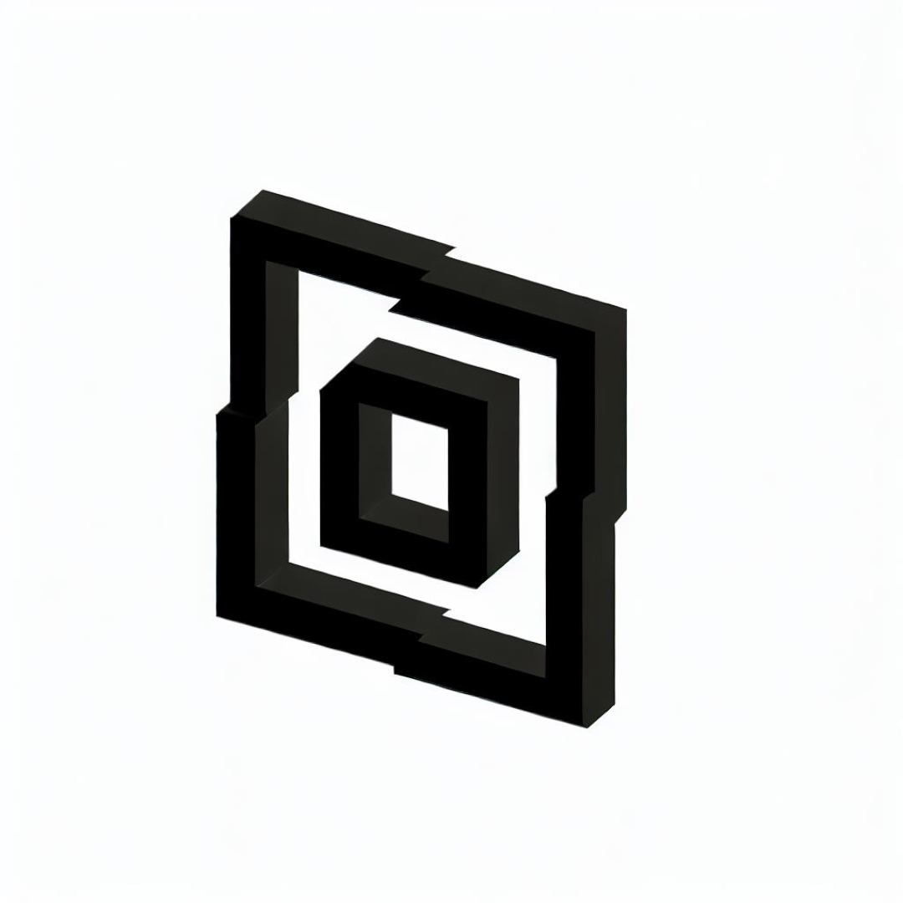
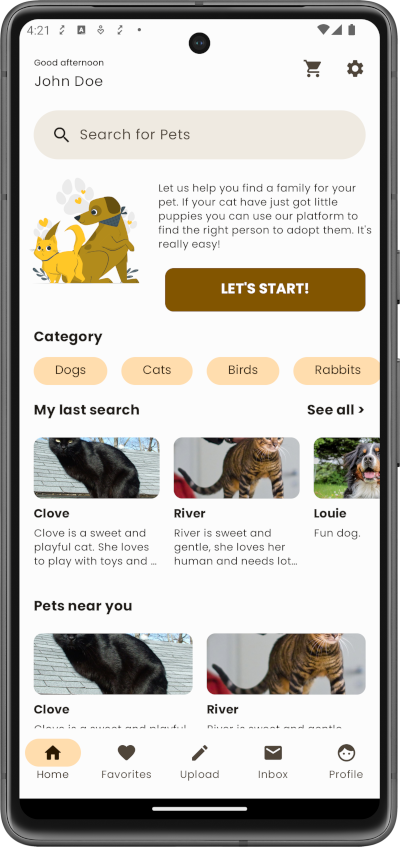

<p align="center">
  
</p>

<h1 align="center">Adoptme</h1>

<p align="center">
  <b>A full-featured open-source Kotlin Multiplatform app template — Android, iOS, Desktop & Backend.</b>
</p>

<p align="center">
  Production-ready · Compose Multiplatform · Shared UI & Logic · Ktor Backend
</p>

<p align="center">
  <a href="https://github.com/MultiplatformKickstarter/Adoptme/actions/workflows/basic.yml">
    
  </a>
  
  
  
  
  
  
  
</p>

---

## What is Adoptme?

**Adoptme** is an opinionated, production-ready Kotlin Multiplatform app template built on top of **Compose Multiplatform**. It targets Android, iOS, and Desktop from a single shared codebase — with a **Ktor backend** included.

Rather than covering only the basics, Adoptme solves the real problems you encounter when taking an app from zero to production: navigation, dependency injection, image loading, internationalization, dark mode, accessibility, CI, and more — all wired up and working out of the box.

Use it as a launchpad for your own KMP application.

---

## Features




### Screens & Flows

- ✅ **Login / Sign Up** — full authentication flow
- ✅ **Onboarding** — swipeable intro slides with localized content
- ✅ **Home** — pet listings with "Near Me" grid and "Last Search" carousel
- ✅ **Search Listing** — filterable pet list by category
- ✅ **Pet Detail** — full pet profile with favorite toggle
- ✅ **Favorites** — lists all favorited pets with unfavorite action
- ✅ **Inbox** — empty-state messages screen ready to extend
- ✅ **Pet Upload** — form to submit a new pet listing
- ✅ **Profile** — logged-in user profile with ratings and options
- ✅ **Profile Detail** — public user profile with their listings
- ✅ **Debug Menu** — developer tools screen (debug builds only)
- ✅ **Account Settings / Settings** — stub screens ready to extend

### Components

- ✅ `PetCardSmall` & `PetCardBig` with favorite heart icon overlay
- ✅ `RatingBar` star component
- ✅ `PickerItem` list row with icon
- ✅ `EmptyLayout` with optional action button
- ✅ `PetsSearchBar`
- ✅ `ColoredSnackBar` with success/error/info types
- ✅ Shimmer loading animation
- ✅ Navigation bar (bottom bar + rail variants)

### Architecture & Tech

- ✅ **Shared UI and Logic** across all platforms
- ✅ **Kotlin 2.4** + **Compose Multiplatform 1.11**
- ✅ **Voyager** — Navigation, Tabs, ScreenModel (ViewModel)
- ✅ **Koin 4** — Dependency Injection with multiplatform support
- ✅ **Ktor 3** (Client + Server)
- ✅ **Kamel 1** — async image loading with per-platform decoders
- ✅ **Kotlin Coroutines** + **StateFlow** for reactive state
- ✅ **Kotlin Serialization** + **Kotlin Datetime**
- ✅ **Multiplatform Settings** — key-value storage
- ✅ **Kermit** — multiplatform logging
- ✅ **Detekt** — static code analysis
- ✅ **Ktlint** — code style linter
- ✅ **Version Catalogs** (`libs.versions.toml`)
- ✅ **Firebase Analytics** (Android)
- ✅ **Ktor Backend** — PostgreSQL + Tomcat + OpenAPI / Swagger

### App-level Features

- ✅ Dark mode ready
- ✅ Internationalization — English, Spanish, French, Italian, German (FIGS + EN)
- ✅ Accessibility + color-accessible themes
- ✅ Edge-to-edge display with `enableEdgeToEdge()`
- ✅ Favorites powered by `StateFlow<Set<Int>>` — reactive across the whole app
- ✅ Basic CI (GitHub Actions)

---

## Requirements

| Platform | Minimum |
|---|---|
| Android | API 26 (minSdk) |
| iOS | 16.0+ |
| Desktop | JVM 21 |
| Backend | JVM 21, PostgreSQL |

---

## Project Structure

```
Adoptme/
├── composeApp/          # Android application entry point
├── shared/              # Shared KMP module (UI + logic, all platforms)
│   └── commonMain/
│       ├── di/          # Koin modules
│       ├── feature/     # Feature modules (favorites, profile, petupload, …)
│       ├── navigation/  # Tab navigation objects
│       ├── ui/          # Screens, components, theme, icons
│       └── localization/# Strings for all supported languages
├── backend/             # Ktor server (REST API, JWT auth, PostgreSQL)
└── gradle/
    └── libs.versions.toml
```

---

## Getting Started

### 1. Clone the repository

```bash
git clone https://github.com/MultiplatformKickstarter/Adoptme.git
cd Adoptme
```

### 2. Run on Android

Open the project in Android Studio and run the `composeApp` configuration.

### 3. Run on Desktop

```bash
./gradlew :composeApp:run
```

### 4. Run on iOS

Open `iosApp/iosApp.xcodeproj` in Xcode and run on a simulator or device.

### 5. Run the Backend

```bash
./gradlew :backend:run
```

> Requires a running PostgreSQL instance. Configure the connection in `backend/src/main/resources/application.conf`.

---

## Backend API

The Ktor backend exposes a REST API secured with **JWT authentication**:

| Method | Endpoint | Description |
|---|---|---|
| `POST` | `/v1/users/create` | Register a new user |
| `POST` | `/v1/users/login` | Login and receive JWT |
| `POST` | `/v1/users/logout` | Logout |
| `GET` | `/v1/pets/list` | List pets for current user |
| `GET` | `/v1/pets/pet` | Get a single pet |
| `POST` | `/v1/pets/create` | Create a pet listing |
| `PATCH` | `/v1/pets/pet/update` | Update a pet listing |
| `DELETE` | `/v1/pets/delete` | Delete a pet listing |
| `GET` | `/v1/profile` | Get current user profile |
| `POST` | `/v1/profile/create` | Create user profile |
| `PATCH` | `/v1/profile/update` | Update user profile |

OpenAPI docs available at `/openapi` when the server is running.

---

## Who made this

| <a href="https://github.com/ferranpons"></a> |
|---|
| [Ferran Pons](https://github.com/ferranpons) |

---

## Contributing

Contributions of any kind are welcome!

1. Open an issue to discuss your idea
2. [Fork the repo](https://github.com/MultiplatformKickstarter/Adoptme/fork)
3. Create your feature branch (`git checkout -b my-new-feature`)
4. Commit your changes (`git commit -am 'Add some feature'`)
5. Push to the branch (`git push origin my-new-feature`)
6. Open a Pull Request

---

## Bugs and Feedback

For bugs, questions and discussions please use [GitHub Issues](https://github.com/MultiplatformKickstarter/Adoptme/issues).

---

## Social Media

<a href="https://twitter.com/mpkickstarter" target="_blank">
  
</a>
&nbsp;
<a href="https://multiplatformkickstarter.com" target="_blank">
  
</a>

---

## License

Copyright 2023–2026 Multiplatform Kickstarter

Licensed under the Apache License, Version 2.0 (the "License");
you may not use this file except in compliance with the License.
You may obtain a copy of the License at

    http://www.apache.org/licenses/LICENSE-2.0

Unless required by applicable law or agreed to in writing, software
distributed under the License is distributed on an "AS IS" BASIS,
WITHOUT WARRANTIES OR CONDITIONS OF ANY KIND, either express or implied.
See the License for the specific language governing permissions and
limitations under the License.

---

<a href="https://storyset.com/user">Illustrations by Storyset</a>

Built with ❤️ for the Kotlin Multiplatform community.
